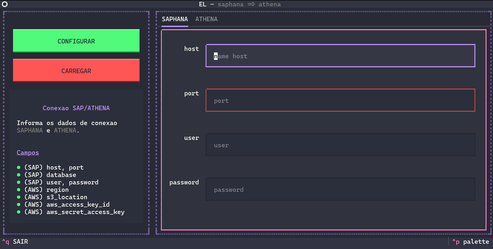
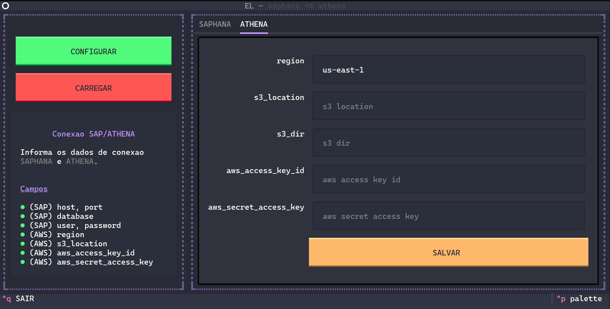
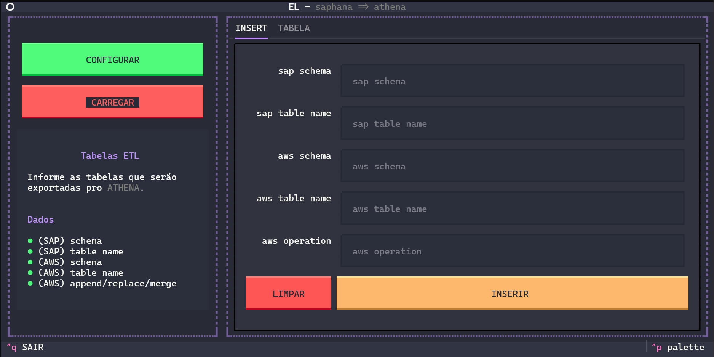
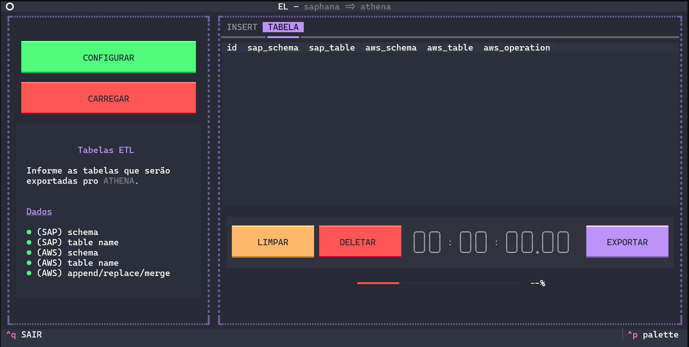

# SAP HANA para Athena

Este projeto permite a exportação de tabelas do SAP HANA para arquivos Parquet temporários e, em seguida, a importação desses dados para o AWS Athena. A interface do projeto é construída com [Textualize](https://textual.textualize.io/), proporcionando uma experiência interativa no terminal.

## Tecnologias Utilizadas

- [Textualize](https://github.com/Textualize/textual) - Interface de usuário no terminal
- [SQLAlchemy](https://www.sqlalchemy.org/) - ORM para interagir com bancos de dados
- [SQLAlchemy-HANA](https://github.com/SAP/sqlalchemy-hana) - Driver do SQLAlchemy para SAP HANA
- [Pandas](https://pandas.pydata.org/) - Manipulação e exportação de dados
- [AWS Athena](https://aws.amazon.com/athena/) - Consulta de dados no S3 com SQL

## Funcionalidades

- Conexão com o SAP HANA para leitura de tabelas
- Exportação de dados para arquivos Parquet de forma temporária
- Upload dos arquivos Parquet para o S3
- Registro da tabela no AWS Athena para consulta
- Interface interativa para configuração e execução das exportações

## Capturas de Tela

### 1. Configuração da conexão com o SAP HANA



### 2. Configuração da conexão com o AWS Athena



### 3. Seleção das tabelas e destino no Athena



### 4. Execução do processo de exportação



## Como Usar

### 1. Instalar o aplicativo com `pipx`

Recomenda-se instalar o aplicativo usando `pipx` para facilitar sua execução como um comando global:

```bash
pip install --user pipx
pipx ensurepath
pipx install .
```

Isso permitirá que o aplicativo seja chamado diretamente como `export`.

### 2. Configurar Conexões

As configurações de conexão são armazenadas em um arquivo JSON. O usuário poderá inserir os dados pela interface na primeira execução.

Exemplo de `.export.json`:

```json
{
    "sap": {
        "host": "host",
        "port": "33035",
        "username": "user",
        "password": "password"
    },
    "athena": {
        "region_name": "us-east-1",
        "s3_staging_dir": "s3://bucket-name/",
        "s3_dir": "s3://bucket-name/tables/",
        "aws_access_key_id": "id",
        "aws_secret_access_key": "secret"
    }
}
```

### 3. Executar o Aplicativo

Após a instalação com `pipx`, basta rodar:

```bash
export
```

A interface interativa permitirá selecionar tabelas, configurar a exportação e acompanhar o progresso do processo.

## Estrutura do Projeto

```
📦 src
 ┣ 📂 etl_saphana_athena
 ┃ ┣ 📜 app.py             # Arquivo principal que inicia a interface
 ┃ ┣ 📜 config.py          # Gerenciamento de configurações
 ┃ ┣ 📜 load.py            # Lógica de exportação SAP HANA → Parquet → Athena
 ┃ ┣ 📜 app.py             # Interface com Textualize
 ┣ 📜 README.md            # Documentação do projeto
```
